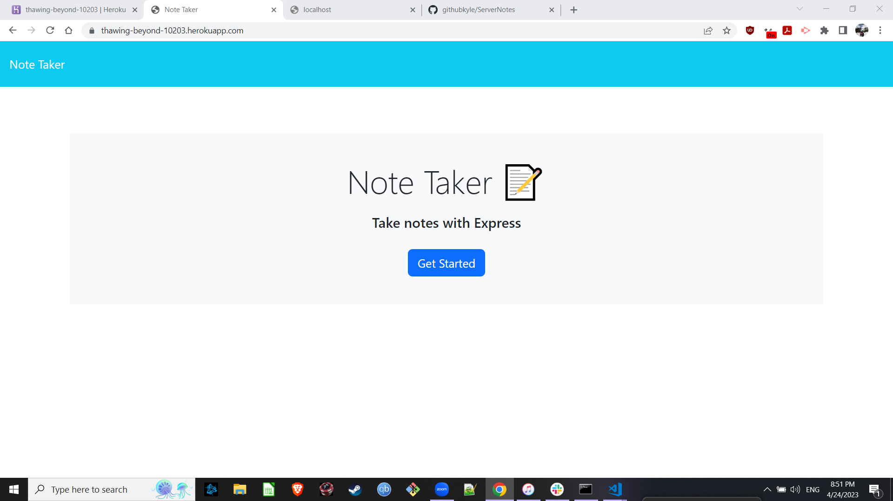

# <Server-Notes>

## Description

This is an app that records notes.

- I wanted to be able to take and save notes on the go.
- I built this project to learn more about servers.
- This solves my note taking problem.
- I learned more about server routes and Heroku.

## Installation

Run npm i and npm start.

## Usage

Here's a pic of the front page:

    

## Credits

I was the sole creator for this app.

## License

License: MIT

